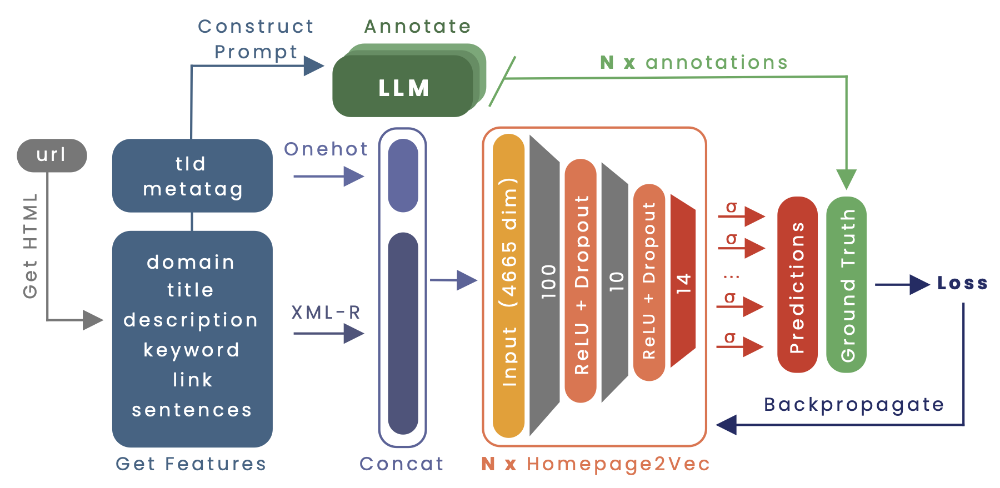

# 🌐 Advancing Homepage2Vec with LLM-Generated Datasets for Multilingual Website Classification

This project was developed in collaboration with the Data Science Lab ([DLab](https://dlab.epfl.ch/)) at EPFL as part of the [Machine Learning](https://www.epfl.ch/labs/mlo/machine-learning-cs-433/) (CS-433) course. We thank [Prof. Robert West](https://people.epfl.ch/robert.west) for enabling the project and [Tiziano Piccardi](https://tizianopiccardi.github.io/) for his guidance and support throughout the project.




## 📚 Abstract

Homepage2Vec, a state-of-the-art open-source model for multilingual, multilabel website classification, has proven powerful in accurately classifying website topics. However, it is limited by its initial training data, which on average only contains a single topic for a website. This study explores the use of Large Language Models (LLMs) for creating a high-quality finetuning dataset that more accurately reflects the topic diversity of a website. We assess various LLM-based labelers and select the best one through comparison to crowdsourced annotations. We generate two variants of a new 10,000-website dataset, `curlie-gpt3.5-10k` and `curlie-gpt4-10k`, for finetuning Homepage2Vec. We show that finetuning Homepage2Vec with these datasets improves its macro F1 from 38% to 42%. Finally, we release both LLM-annotated datasets publicly.

## 🔗 Shortcuts

Here is a list of things that you likely want to do:

* Find all project details in the full [report](report.pdf).
* Inspect the experiments on [W&B](https://wandb.ai/ml-project-2-mlp/homepage2vec).
* Download the LLM-annotated datasets `curlie-gpt3.5-10k` and `curlie-gpt4-10k` from [Zenodo](https://doi.org/10.5281/zenodo.10413068). If you want to use it for your research, please cite it as follows:

```bibtex
@dataset{curlie-gpt-10k,
    author       = {Nutter, P. and Senghaas, M. and Cizinsky, L.},
    title        = {Curlie Enhanced with LLM Annotations: Two Datasets for Advancing Homepage2Vec's Multilingual Website Classification},
    year         = 2023,
    version      = {1.0.0},
    publisher    = {Zenodo},
    doi          = {10.5281/zenodo.10413068},
    url          = {https://doi.org/10.5281/zenodo.10413068}
}
```
<!-- if you wanna cite it in your work -->

## 🔁 Reproducibility

### ⚙️ Environment Setup

To reproduce the results, you need to have the correct **Python version** inside the specified **virtual environment** to use all packages with the correct version.

We use [Poetry](https://python-poetry.org/) for package management and versioning. This project was developed for Python `3.10.13` and Poetry `1.7`. We recommend installing Python via [pyenv](https://github.com/pyenv/pyenv) and Poetry via [pipx](https://pypa.github.io/pipx/).

```bash
pyenv install 3.10.13
```

Then, install Poetry via `pipx`

```bash
pipx install poetry==1.7.0
```

The project has a `.python-version` in the root directory, which will automatically activate the correct Python version when you enter the project directory. You can check that the correct Python version is used by running `python --version` (should be Python `3.10.13`) and that `poetry --version` is `1.7.0`.

Next, we install all dependencies via Poetry:

```bash
poetry install
```

You can now run the project by using the virtual environment created by Poetry. You can choose to run individual scripts from the command line by prefixing the command with `poetry run`, e.g. `poetry run python main.py` or create a shell that will load the virtual environment via `poetry shell`. If you run the notebooks, make sure to select the correct kernel (should be `venv`).

To test if the setup was successful, you can run the unit tests via `poetry run pytest tests/test_setup.py`. It tests for the correct Python version and that all dependencies are installed.

Last but not the least, since we are using OpenAI's API, create a `.env` file in the root directory and add your API key as follows:

```bash
OPENAI_API_KEY=<your-api-key>
```

Make sure that you have at least a few dollars so you do not run into any rate-limiting issues. From our experience, to label one of the provided websites on average costs around `$0.0001`.

### 🧪 Run the Experiments

In our project, we define a finetuning experiment as a combination of a dataset and labeler. We precisely define each of these parameters via [hydra](https?//hydra.cc/). The following table shows the available options for the parameters:

| Parameter | Description                                        | Available Options                                                                                                                        |
| --------- | -------------------------------------------------- | ---------------------------------------------------------------------------------------------------------------------------------------- |
| data      | Dataset to be labeled and then finetuned on        | `crowdsourced`,  `curlie` (uses a random subsplit of 10,000 websites)                                                                    |
| labeler   | Labeler you want to use for the dataset annotation | `human` (only available for `crowdsourced` dataset), `gpt3.5-zeroshot-context1`, `gpt3.5-oneshot-context1`, ..., `gpt4-oneshot-context3` |

Here is an example of how to finetune Homepage2Vec using the labels generated by the labeler `gpt3.5-oneshot-context2` on the `curlie` dataset (subset of 10,000 websites):

```bash
poetry run train \
    train_data=curlie \
    train_labeler=gpt3.5-oneshot-context2 \
    test_data=crowdsourced \
    test_labeler=human \
    logger=none
```

*The details of the training, data splits, and more can be customised via the configuration files in the `conf` folder or dynamically via command line arguments. To print out a full list of the default configurations you can append the suffix `--cfg job` to the above command.*

The command triggers the following steps:

1. Scrapes the HTML content of the URLs in `curlie` (uses 10,000 websites) and `crowdsourced` datasets
2. Preprocesses the HTML content, and extracts relevant features (e.g. title, description, keywords, etc.) 
3. Embed the extracted features following the pipeline proposed in [Homepage2Vec](https://arxiv.org/abs/2008.11935) paper
4. Label the datasets using the given labeler by providing information about the website (e.g. title, description, keywords, etc.) as input context and retrieve the relevant website topics.
5. Finetune Homepage2Vec on the train dataset while validation and evaluating on splits from the test dataset.


📣 **Important:** By default the repository only contains the raw URLs for a website corpus. Thus, running this script will first scrape, process and embed all the webpages for the dataset and then subsequently annotate it with the given labeler. For the `curlie` dataset, this will take a significant amount of time. To test reproducibility, you can download the entire compressed `data` folder from [Google Drive](https://drive.google.com/file/d/1ts8nDp21JrN1oqyiLihQeIWgzSs7lDp4/view?usp=sharing). The folder contains all scraped, processed and embedded websites and the labels from all labelers considered in this study. Uncompress the folder and put it in the correct location and re-run the above command to run a finetuning run.

Finally, we provide convenience bash scripts that exactly reproduce the experiments in the report. In the first phase, we aim to find the best labeler by re-annotating the `crowdsourced` data with all GPT labelers. Run this script as follows:

```bash
./label.sh
```

The analysis of the results can be found in the notebook [eda.ipynb](notebooks/eda.ipynb).

Finally, we finetune Homepage2Vec on the `curlie-10k` dataset with the two best labelers found in the previous step. Run this script as follows:

```bash
./finetune.sh
```

The analysis of the results can be found in the notebook [analysis.ipynb](notebooks/analysis.ipynb).